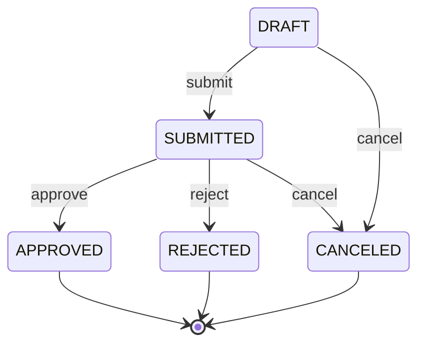

# Proposal Management API

API REST para gerenciamento de propostas comerciais — desafio técnico TsCorp.

**Stack:** Laravel 12 · PHP 8.3 · MySQL 8 · Nginx · Docker · PHPUnit

---

## Visão geral

Esta API implementa o ciclo de vida completo de propostas comerciais: cadastro de clientes, criação e atualização de propostas, transições de status, exclusão lógica, auditoria e busca paginada.

---

## Quick Start

```bash
git clone <repository-url>
cd challengeTsCorp
docker compose up -d --build
```

A aplicação estará disponível em: **http://localhost:8080**

### Fluxo completo de execução

```bash
# 1. Subir containers
docker compose up -d --build

# 2. Executar migrations
docker compose exec app php artisan migrate

# 3. Popular banco com dados de exemplo (opcional)
docker compose exec app php artisan db:seed

# 4. Verificar saúde da aplicação
curl http://localhost:8080/health

# 5. Rodar testes
docker compose exec app php artisan test

# 6. Acessar Swagger
open http://localhost:8080/api/documentation
```

### Health check

```bash
curl http://localhost:8080/health
```

Resposta esperada:

```json
{
  "data": {
    "status": "ok",
    "database": "connected"
  }
}
```

---

## Variáveis de ambiente

Copie `.env.example` para `.env` (feito automaticamente no primeiro start do container).

| Variável | Descrição | Padrão |
|---|---|---|
| `APP_PORT` | Porta HTTP exposta pelo Nginx | `8080` |
| `APP_URL` | URL base da aplicação | `http://localhost:8080` |
| `DB_HOST` | Host do MySQL (Docker) | `mysql` |
| `DB_DATABASE` | Nome do banco | `proposal_api` |
| `DB_USERNAME` | Usuário do banco | `proposal` |
| `DB_PASSWORD` | Senha do banco | `secret` |
| `DB_ROOT_PASSWORD` | Senha root do MySQL | `rootsecret` |

---

## Comandos úteis

```bash
# Subir containers
docker compose up -d

# Parar containers
docker compose down

# Logs
docker compose logs -f

# Artisan
docker compose exec app php artisan <command>

# Composer
docker compose exec app composer <command>

# Regenerar documentação Swagger
docker compose exec app php artisan l5-swagger:generate
```

---

## Testes

```bash
docker compose exec app php artisan test
```

**Baseline validado:** 64 testes, 435 assertions (feature tests apenas).

| Arquivo de teste | Endpoint(s) coberto(s) |
|---|---|
| `StoreClientTest` | `POST /clients` |
| `ShowClientTest` | `GET /clients/{id}` |
| `StoreProposalTest` | `POST /proposals` (idempotência, auditoria) |
| `ShowProposalTest` | `GET /proposals/{id}` |
| `UpdateProposalTest` | `PATCH /proposals/{id}` (optimistic lock) |
| `DestroyProposalTest` | `DELETE /proposals/{id}` (soft delete) |
| `ProposalStatusActionsTest` | submit, approve, reject, cancel |
| `ListProposalsTest` | `GET /proposals` (filtros, ordenação, paginação) |
| `ListProposalAuditsTest` | `GET /proposals/{id}/audit` |

### Gate mínimo do PDF (4 cenários obrigatórios)

| # | Cenário | Teste |
|---|---|---|
| 1 | Transição válida e inválida de status | `ProposalStatusActionsTest` |
| 2 | Idempotência (create + submit) | `StoreProposalTest`, `ProposalStatusActionsTest` |
| 3 | Conflito de versão (HTTP 409) | `UpdateProposalTest`, `DestroyProposalTest`, `ProposalStatusActionsTest` |
| 4 | Busca com filtros e paginação | `ListProposalsTest` |


---

## Swagger / OpenAPI

- **UI:** http://localhost:8080/api/documentation
- **JSON gerado:** `storage/api-docs/api-docs.json`
- **Fonte das anotações:** pasta `documentation/` (desacoplada dos controllers)
- **Regenerar:** `php artisan l5-swagger:generate`

Estrutura da documentação:

```
documentation/
├── OpenApi/OpenApiSpec.php       # Info global + Server
├── Tags/                         # Clients, Proposals
├── Schemas/                      # Resources + Error schemas
└── Operations/V1/
    ├── Clients/                  # 2 operations
    └── Proposals/                # 10 operations
```

---

## API Reference

Base URL: `http://localhost:8080/api/v1`

### Endpoints

| Method | EN Route | PT Route (PDF) | RF | Descrição |
|---|---|---|---|---|
| `POST` | `/clients` | `/clientes` | RF-01 | Cadastrar cliente |
| `GET` | `/clients/{id}` | `/clientes/{id}` | RF-02 | Buscar cliente |
| `POST` | `/proposals` | `/propostas` | RF-03 | Criar proposta |
| `GET` | `/proposals` | `/propostas` | RF-11, RF-12 | Pesquisar propostas |
| `GET` | `/proposals/{id}` | `/propostas/{id}` | RF-03 | Buscar proposta |
| `PATCH` | `/proposals/{id}` | `/propostas/{id}` | RF-04 | Atualizar proposta |
| `DELETE` | `/proposals/{id}` | — | RF-09 | Exclusão lógica |
| `POST` | `/proposals/{id}/submit` | `/propostas/{id}/submit` | RF-05 | Submeter proposta |
| `POST` | `/proposals/{id}/approve` | `/propostas/{id}/approve` | RF-06 | Aprovar proposta |
| `POST` | `/proposals/{id}/reject` | `/propostas/{id}/reject` | RF-07 | Rejeitar proposta |
| `POST` | `/proposals/{id}/cancel` | `/propostas/{id}/cancel` | RF-08 | Cancelar proposta |
| `GET` | `/proposals/{id}/audit` | `/propostas/{id}/auditoria` | RF-10 | Consultar auditoria |

### Headers HTTP

| Header | Obrigatório | Endpoints | Descrição |
|---|---|---|---|
| `Idempotency-Key` | Sim | `POST /proposals`, `POST /proposals/{id}/submit` | Garante idempotência. Mesma chave + mesma operação retorna o mesmo resultado. |
| `X-Actor` | Não | Operações de escrita | Identificador do ator: `system` ou `user:{id}` (ex.: `user:42`). Padrão: `system`. |

### Envelope de resposta

```json
// Sucesso (item único)
{ "data": { } }

// Sucesso (lista paginada)
{ "data": [], "meta": { }, "links": { } }

// Erro
{ "message": "", "errors": { } }
```

### HTTP Status Codes

| Código | Uso |
|---|---|
| `200` | Sucesso (GET, PATCH, ações de status) |
| `201` | Criado (POST) |
| `204` | Sem conteúdo (DELETE) |
| `404` | Recurso não encontrado |
| `409` | Conflito de versão (optimistic lock) |
| `422` | Erro de validação ou regra de negócio |

---

## Fluxo de Status

Estados finais (`APPROVED`, `REJECTED`, `CANCELED`) são imutáveis.



| From | To | Action |
|---|---|---|
| `DRAFT` | `SUBMITTED` | submit |
| `DRAFT` | `CANCELED` | cancel |
| `SUBMITTED` | `APPROVED` | approve |
| `SUBMITTED` | `REJECTED` | reject |
| `SUBMITTED` | `CANCELED` | cancel |

Transição inválida retorna **HTTP 422**.

---

## Mapeamento PT → EN (RF-13)

### Justificativa

O PDF do desafio utiliza rotas e campos em português. Esta implementação adota **inglês** por convenção REST corporativa, interoperabilidade com clientes internacionais e alinhamento com padrões de APIs Laravel/JSON amplamente adotados.

### Rotas

| PDF (PT) | Implementação (EN) |
|---|---|
| `POST /api/v1/clientes` | `POST /api/v1/clients` |
| `GET /api/v1/clientes/{id}` | `GET /api/v1/clients/{id}` |
| `POST /api/v1/propostas` | `POST /api/v1/proposals` |
| `GET /api/v1/propostas` | `GET /api/v1/proposals` |
| `GET /api/v1/propostas/{id}` | `GET /api/v1/proposals/{id}` |
| `PATCH /api/v1/propostas/{id}` | `PATCH /api/v1/proposals/{id}` |
| `DELETE /api/v1/propostas/{id}` | `DELETE /api/v1/proposals/{id}` |
| `POST /api/v1/propostas/{id}/submit` | `POST /api/v1/proposals/{id}/submit` |
| `POST /api/v1/propostas/{id}/approve` | `POST /api/v1/proposals/{id}/approve` |
| `POST /api/v1/propostas/{id}/reject` | `POST /api/v1/proposals/{id}/reject` |
| `POST /api/v1/propostas/{id}/cancel` | `POST /api/v1/proposals/{id}/cancel` |
| `GET /api/v1/propostas/{id}/auditoria` | `GET /api/v1/proposals/{id}/audit` |

### Campos JSON

| PDF (PT) | JSON (EN) |
|---|---|
| `nome` | `name` |
| `documento` | `document` |
| `cliente_id` | `client_id` |
| `produto` | `product` |
| `valor_mensal` | `monthly_value` |
| `versao` | `version` |
| `origem` | `origin` |
| `evento` | `event` |

---

## Idempotência

Operações idempotentes: **criação** (`POST /proposals`) e **submissão** (`POST /proposals/{id}/submit`).

### Estratégia

- Tabela `idempotency_keys` com chave única por `(operation, idempotency_key)`
- Hash SHA-256 do payload normalizado para detectar reutilização com payload diferente
- Operações: `proposal.create` e `proposal.submit`
- Requisição com mesma chave e mesmo hash → retorna o recurso existente
- Requisição com mesma chave e hash diferente → **HTTP 422**

### Header

```
Idempotency-Key: <string-unica-por-operacao>
```

---

## Auditoria

Toda operação relevante gera registro em `proposal_audits`:

| Evento | Quando |
|---|---|
| `CREATED` | Criação de proposta |
| `UPDATED_FIELDS` | Alteração de `product` ou `monthly_value` |
| `STATUS_CHANGED` | Transição de status |
| `DELETED_LOGICAL` | Soft delete |

Campos: `actor`, `event`, `payload` (JSON), `created_at`.

Consulta: `GET /api/v1/proposals/{id}/audit` (paginado, ordenado cronologicamente).

---

## Banco de dados

| Tabela | Descrição |
|---|---|
| `clients` | Clientes (email e document únicos) |
| `proposals` | Propostas (soft delete, optimistic lock via `version`) |
| `proposal_audits` | Trilha de auditoria append-only |
| `idempotency_keys` | Chaves de idempotência (create/submit) |

```bash
docker compose exec app php artisan migrate
docker compose exec app php artisan db:seed
```

---

## Estrutura do projeto

```
app/
├── Enums/              # ProposalStatus, ProposalOrigin, ProposalAuditEvent
├── Exceptions/         # EntityNotFound, Business, OptimisticLock, StatusTransition
├── Http/
│   ├── Controllers/Api/V1/
│   ├── Requests/
│   └── Resources/
├── Models/
├── Rules/              # BrazilianDocument (CPF/CNPJ)
└── Services/           # Regras de negócio

documentation/          # Swagger desacoplado (OpenAPI attributes)
tests/Feature/Api/V1/   # 64 feature tests
docker/                 # Nginx + PHP entrypoint
```

---

## Exemplos curl

### Clientes

```bash
# Criar cliente
curl -s -X POST http://localhost:8080/api/v1/clients \
  -H "Content-Type: application/json" \
  -d '{"name":"Acme Corp","email":"contato@acme.com","document":"12345678909"}'

# Buscar cliente
curl -s http://localhost:8080/api/v1/clients/1
```

### Propostas — CRUD

```bash
# Criar proposta (idempotente)
curl -s -X POST http://localhost:8080/api/v1/proposals \
  -H "Content-Type: application/json" \
  -H "Idempotency-Key: create-001" \
  -H "X-Actor: user:42" \
  -d '{"client_id":1,"product":"Cloud Plan","monthly_value":299.90,"origin":"API"}'

# Buscar proposta
curl -s http://localhost:8080/api/v1/proposals/1

# Atualizar proposta (optimistic lock)
curl -s -X PATCH http://localhost:8080/api/v1/proposals/1 \
  -H "Content-Type: application/json" \
  -H "X-Actor: user:42" \
  -d '{"version":1,"product":"Cloud Premium","monthly_value":399.90}'

# Excluir logicamente
curl -s -X DELETE http://localhost:8080/api/v1/proposals/1 \
  -H "Content-Type: application/json" \
  -d '{"version":2}'
```

### Propostas — Status

```bash
# Submeter (idempotente)
curl -s -X POST http://localhost:8080/api/v1/proposals/1/submit \
  -H "Content-Type: application/json" \
  -H "Idempotency-Key: submit-001" \
  -d '{"version":2}'

# Aprovar
curl -s -X POST http://localhost:8080/api/v1/proposals/1/approve \
  -H "Content-Type: application/json" \
  -d '{"version":3}'

# Rejeitar
curl -s -X POST http://localhost:8080/api/v1/proposals/1/reject \
  -H "Content-Type: application/json" \
  -d '{"version":3}'

# Cancelar
curl -s -X POST http://localhost:8080/api/v1/proposals/1/cancel \
  -H "Content-Type: application/json" \
  -d '{"version":1}'
```

### Propostas — Busca e auditoria

```bash
# Listar com filtros e paginação
curl -s "http://localhost:8080/api/v1/proposals?status=DRAFT&per_page=10&page=1"
curl -s "http://localhost:8080/api/v1/proposals?client_id=1&product=Cloud&sort_by=monthly_value&sort_direction=asc"

# Auditoria
curl -s "http://localhost:8080/api/v1/proposals/1/audit?per_page=5"
```

---


## Licença

Projeto de desafio técnico.
